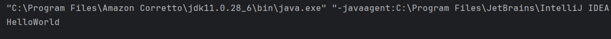
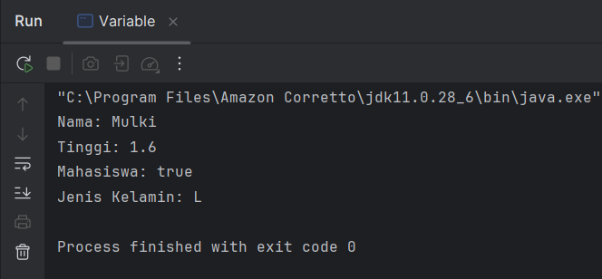
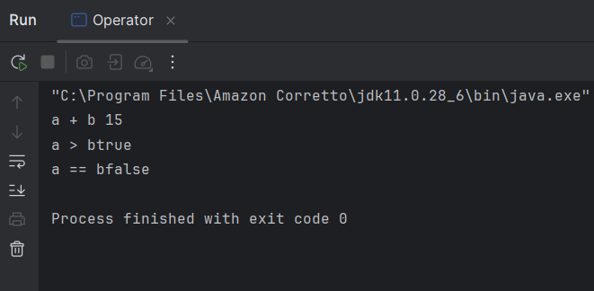
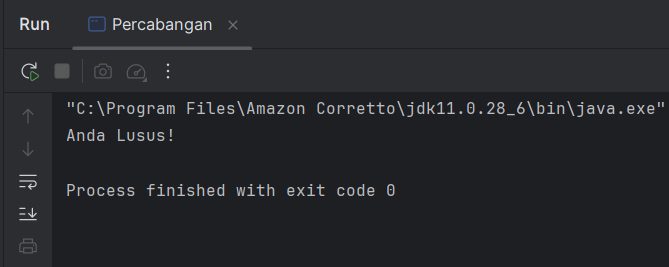
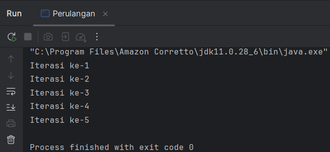
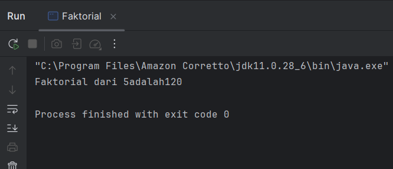
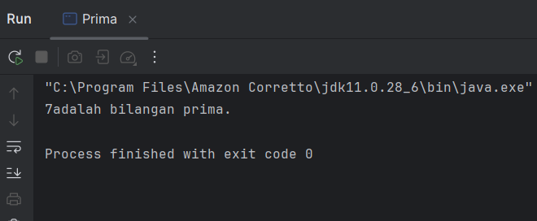
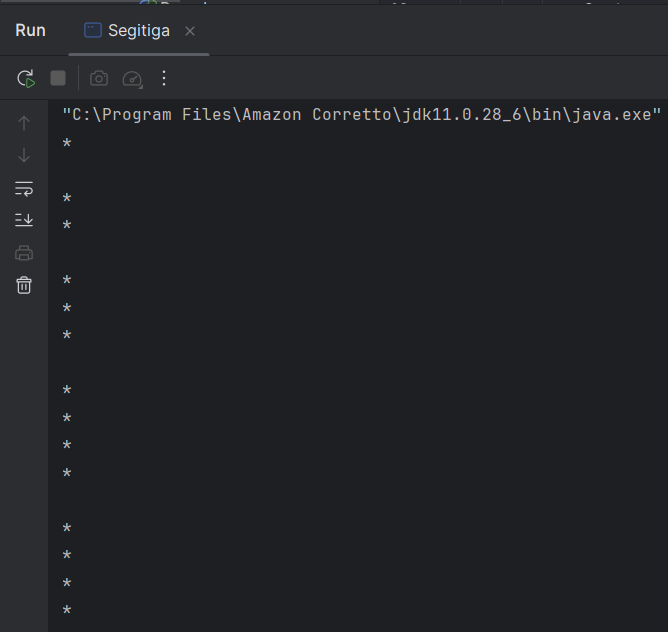

# Laporan Modul 1: Review Dasar Pemrograman Java
**Mata Kuliah:** PRAKTIKUM DESIGN PATTERN
**Nama:** MALIKUL MULKI  
**NIM:** 2024573010079
**Kelas:** TI.2A

---

## 1. Abstrak
Pada praktikum menjelaskan tentang pengenalan dan dasar dasar dari Java, seperti tentang variabel dan tipe data, operator dan expressi,pencabangan,pengulangan,sehingga kita mampu membuat program
sederhana menggunkan Java

---
## 2. Praktikum

### Praktikum 1 - Pengenalan Java dan lingkungan Pengembangan

#### Dasar Teori
Java adalah bahasa pemrograman yang berorientasi pada objek (object-oriented programming).

Java memiliki motto yaitu ‘Write Once, Run Anywhere‘, yang berarti program yang ditulis dengan Java dapat dijalankan di berbagai lingkungan, seperti perangkat berbasis mobile dan deskop dan aplikasi berbasis web.

Sebelum kita memulai membuat program java,kita memerlukan :

1.JDk(Java Development Kit) berfungsi sebagai Komponen inti yang mengubah kode Java (.java) menjadi bytecode.

2.IDE (Integrated Development Environment) berfungsi sebagai  Aplikasi editor teks tempat programmer menulis kodemenyediakan fitur seperti auto-completion, deteksi error langsung, dan pengelolaan proyek.

Intinya jika dengan IDE tanpa adanya JDK maka kita tidak bisa mengembangkan aplikasi Java.
#### Langkah Praktikum
1. Sebelum membuat program Java pastikan dulu kita telah menginstall JDK dan IDE,pada praktikum ini menggunakan JDK berupa Amazon Correto dan IDE berupa Intellij.
2. Lalu membuat suatu module bernama ti_design_pattern.
3. Jika modul sudah dibuat maka terdapat folder src,maka didalam folder src tambahkan package dengan nama Praktikum_1.
4. tambahkan java class dengan nama HelloWorld,dan tuliskan code :

    public class HelloWorld {

    public static  void main (String[] args){

    System.out.println("Hello,World");

    }

    }

5. Lalu run program untuk melihat hasil program
#### Screenshoot Hasil

#### Analisa dan Pembahasan
Pada bagian 1 menjelasankan tentang Java dan cara agar dapat menggunakan bahasa java dengan IDE dengan JDK sebagai compailer code JAVA agar bisa di mengerti oleh komputer.

### Praktikum 2 - Variabel dan Tipe Data

#### Dasar Teori
Variabel adalah tempat digunakan untuk menyimpan nilai sementara.

Tipe Data adalah jenis data yang tersimpan dalam variabel contoh tipe data yaitu int(Angka atau bilangan bulat),char(Tipe data karakter tunggal),float(Bilangan desimal),double(Bilangan desimal dengan kapasitas lebih besar),boolean(Tipe data yang hanya bernilai benar atau salah (true/false)),string(Kumpulan dari karakter yang membentuk teks).

#### Langkah Praktikum
1.Tambahkan Java class pada package Praktikum_1 dengan nama Variabel.
2.Ketikkan code sebagai berikut :

        package modul_1;
    
    public class Variable {
    public  static void main(String[] args){
    int umur = 20;
    double tinggi = 1.60;
    boolean isMahasiswa = true;
    char jenisKelamin = 'L';
    String nama = "Mulki";
    
            System.out.println("Nama: " + nama);
            System.out.println("Tinggi: "+ tinggi);
            System.out.println("Mahasiswa: "+ isMahasiswa);
            System.out.println("Jenis Kelamin: "+ jenisKelamin);
    
        }
    }

#### Screenshoot Hasil

#### Analisa dan Pembahasan
Pada Praktikum ke 2 ini kita membahas tentang variabel dan tipe data, pada praktikum ini kita menggunakan umur,tinggi,isMahasiswa,jeniskelamin,dan nama sebagai variabel,sedangkan
tipe data terletak di depan variabel yaitu int,boolean,double,char dan string.

### Praktikum 3 - Operator dan Expressi

#### Dasar Teori
Berikut operator yang di gunakan dalam Java untuk melakukan operasi antar variabel dan nilai.Berikut jenis operatornya:

#### Langkah Praktikum
1.Tambahkan Java class pada package Praktikum_1 dengan nama Operator.
2.Ketikkan code sebagai berikut :

    package modul_1;
    
    public class Operator {
    public static void main(String[] args){
    int a = 10;
    int b = 5;
    
            System.out.println("a + b "+ (a + b));
            System.out.println("a > b"+ (a > b));
            System.out.println("a == b"+ (a==b));
        }
    }

#### Screenshoot Hasil

#### Analisa dan Pembahasan
Pada praktikum 3 ini kita membahas tentang operasi operasi yang bisa di gunakan dalam program java, operasi dalam program diatas
adalah penugasan dan aritmatika

### Praktikum 4 - Percabangan (If-Else dan Switch-Case)

#### Dasar Teori
Percabangan hanyalah sebuah istilah yang digunakan untuk menyebut alur program yang bercabang.
Percabangan juga dikenal dengan “Control Flow”, “Struktur Kondisi”, “Struktur IF”, “Decision” namun semua itu sama. Percabamgan dalam Java menggukan kata kunci Percabangan IF,Percabangan IF/ELSE,dan Percabangan IF/ELSE/IF atau SWITCH/CASE.
#### Langkah Praktikum
1.Tambahkan Java class pada package Praktikum_1 dengan nama Percabangan.

2.Ketikkan code sebagai berikut :

    package Praktikum_1;
    public class percabangan {
    public static void main(String[] args){
    int nilai = 85;

        if ( nilai >= 75){
    System.out.println("Anda Lulus");
    }else{
    System.out.println("Anda Tidak Lulus");
    }
    }
    }

#### Screenshoot Hasil

#### Analisa dan Pembahasan
Pada Praktikum ini kita menggunakan If/Else untuk percabangan yang dimana percabangan tersebut di gunakan untuk
menentukan lulus atau tidak lulus berdasarkan nilai dalam variabel nilai.

### Praktikum 5 -  Perulangan (For, While, Do-While)

#### Dasar Teori
Perulangan adalah sebuah cara untuk mengulangi kode yang sama beberapa kali dan akan berhenti jika kondisi tidak memenuhi. perulangan yang tersedia dalam java adalah do-while,While Loop,For Loop.

#### Langkah Praktikum
1.Tambahkan Java class pada package Praktikum_1 dengan nama Perulangan.

2.Ketikkan code sebagai berikut :

    package Praktikum_1;

    public class perulangan {
    public static void main(String [] args){
    for(int i = 1; i <=5; i++){
    System.out.println("iterasi ke - " + i);
    }
    }
    }

#### Screenshoot Hasil

#### Analisa dan Pembahasan
Pada Praktikum ini perulangan yang di gunakan adalah for/
perulangan diatas digunakan untuk menghitung angka dari 1 sampai 5 dengan beberapa syarat pada for
yaitu nilai i adalah 1,i harus lebih kecil atau sama dengan 5, lalu nilai i akan terus bertambah 1 jika syarat sebelumnya masih memenuhi.

### Praktikum 6 -Practice Problem dan Solusinya

#### Dasar Teori
Pada praktikum ini kita membuat code untuk memecahkan masalah faktorial,mencari bilangan prima,dan mencetak pola segitiga
#### Langkah Praktikum
1.Tambahkan Java class pada package Praktikum_1 dengan nama factorial.

2.Ketikkan code sebagai berikut :

    package Praktikum_1;

    public class factorial {
    public static void main(String[] args){
    int n =5;
    int hasil =1;
    for (int i=1; i<=n;i++){
    hasil*=i;
    }
    System.out.println("Faktorial dari "+n+" adalah"+ hasil);
    }
     }

3.Tambahkan Java class pada package Praktikum_1 dengan nama Prima.

4.Ketikkan code sebagai berikut :

    package Praktikum_1;

    public class Prima {
    public static void main(String[] args){
    int n =7;
    boolean isprima = true;
    for( int i =2; i<=n/2;i ++){
    if(n%i==0){
    isprima=false;
    break;
    }
    }
    System.out.println(n+(isprima ?" adalah bilangan prima" : "bukan bilangan prima."));
    }
    }

5.Tambahkan Java class pada package Praktikum_1 dengan nama segitiga.

6.Ketikkan code sebagai berikut :

    package Praktikum_1;

    public class segitiga {
    public static void main(String[] args){
    int tinggi = 5;
    for ( int i =1; i <= tinggi; i++){
    for(int j =1; j<=i;j++){
    System.out.print("* ");
    }
    System.out.println();
    }
    }
    }

#### Screenshoot Hasil
1.Faktorial :

2.Prima :

3.Segitiga :

#### Analisa dan Pembahasan
Pada praktikum ini kita membahas tentang cara-cara untuk menyelesaikan masalah dengan Java
dengan masalah yang pertama yaitu factorial dari 5 yaitu 120, yaitu 5*4*3*2*1 = 120,
masalah kedua yaitu menentukan bilangan prima yaitu dengan syarat bilangan tersebut hanya bisa di bagi bilangan itu sendiri dan angka 1'
masalah ketiga yaitu menggambar suatu segitiga dengan simbol bintang menggunakan Java.

---

## 3. Kesimpulan

Praktikum ini memberi dar dari pemograman Java, sekaligus sebagai  mengingatkan kembali dasar dasar dari pemograman java dan cara agar dapat menggunakan pemograman Java.
mulai dari meng install JDK dan IDE untuk dapat membuat program Java, lalu penjelasan tentang variabel dan tipe data,tentang operator yang di gunakan dalam Java,percabangan,perulangan,dan latihan untuk memecahkan masalah seperti pada praaktikum ke 6 yaitu mancari bilangan prima, faktorial dari suatu bilangan,dan membentuk segitiga.

---

## 4. Referensi
Cantumkan sumber yang Anda baca (buku, artikel, dokumentasi) — minimal 2 sumber. Gunakan format sederhana (judul — URL).

Pengenalan Java :

https://www.rumahweb.com/journal/java-adalah/#Apa_itu_Java

Variabel dan Tipe data :

https://www.petanikode.com/java-variabel-dan-tipe-data/

Operator :

https://www.petanikode.com/java-operator/

Percabangan:

https://www.petanikode.com/java-percabangan/

Perulangan:

https://id.javascript.info/while-for

---